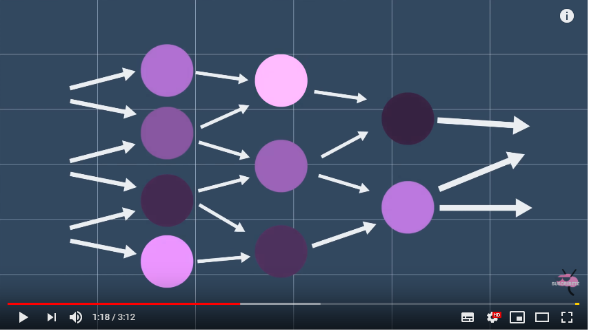
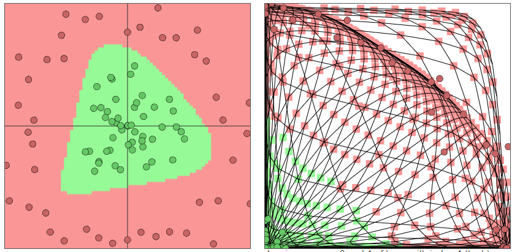
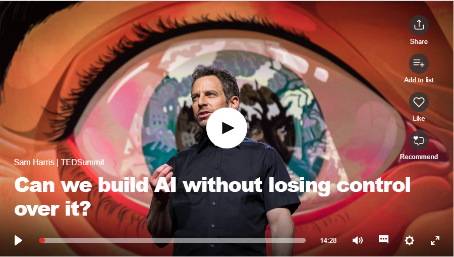
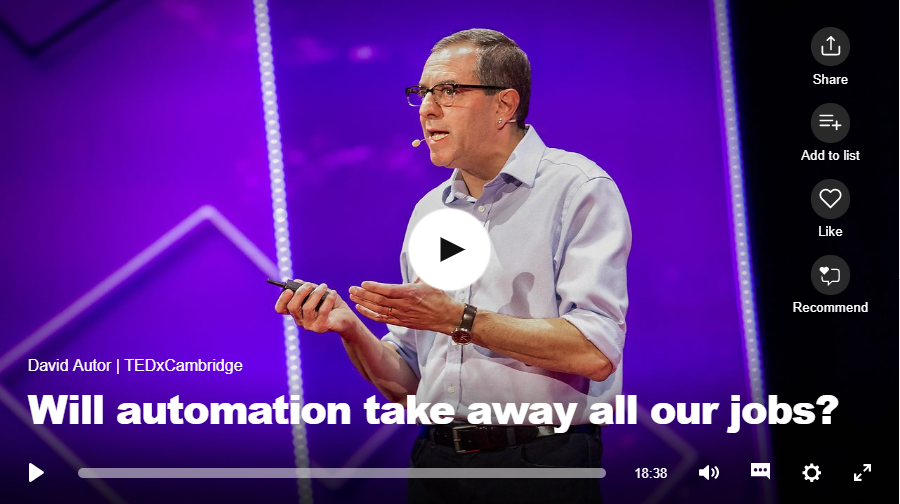

# IA: Inteligencia Artificial

### Objetivo

El objetivo de esta clase es que el alumno comprenda de manera simple qué es la inteligencia artificial. Así mismo, que interiorice conceptos  básicos asociados con la IA y que comprenda que supondrá en un futuro la implementación de esta tecnología.

[source](https://www.technologyreview.com/s/612437/what-is-machine-learning-we-drew-you-another-flowchart/)

| Contenido | Duración |
| ----- | ----- |
| **Clase** | **75 minutos** |
| **Inteligencia Artificial** | **30 minutos** |
| Qué es | 10 minutos |
| Cuáles son sus fundamentos | 5 minutos |
| Tipos de inteligencia artificial | 5 minutos |
| Aplicaciones prácticas de la inteligencia artificial | 10 minutos |
| **Redes Neuronales** | **15 minutos** |
| Qué es una red neuronal | 10 minutos |
| Cómo trabaja | 2,5 minutos |
| Ejemplo | 2,5 minutos |
| **Qué supondrá** | **20 minutos** |
| **Práctica en Redes Neuronales** | **45 minutos** |

| [Práctica](https://pauandalt.github.io/Practica_Redes_Neuronales/) | 30-45 minutos ||

***
## Inteligencia Artificial

### Qué es:

+ [Link 1](https://www.iberdrola.com/te-interesa/tecnologia/que-es-inteligencia-artificial): *En el primer parrafo se define qué es la inteligencia artificial*

+ [Link 2](https://es.wikipedia.org/wiki/Inteligencia_artificial): *Definición más extensa, incluye definición técnica y no técnica.*

+ [Link 3](http://people.cs.ubc.ca/~poole/ci/ch1.pdf): 

> La inteligencia artificial (IA), es la inteligencia llevada a cabo por máquinas. En ciencias de la computación, una máquina «inteligente» ideal es un agente flexible que percibe su entorno y lleva a cabo acciones que maximicen sus posibilidades de éxito en algún objetivo o tarea.

[source](http://people.cs.ubc.ca/~poole/ci/ch1.pdf): Poole, David. «Computational Intelligence: A Logical Approach» (en inglés). Nueva York: Oxford University Press. p. 1. Consultado el 7 de junio de 2019.

### Cuáles son sus fundamentos: *(contenido opcional: no es necesario saber los fundamentos para conocer su funcionamiento y usos)*

+ [Link 1](http://intartificialdcarolinamolina.blogspot.com/2015/11/fundamentos-de-la-inteligencia.html): *fundamentos de la IA explicados basandose en las diferentes disciplinas sobre las que se ha construido*

* [link 2](http://www.ia.urjc.es/grupo/docencia/fia/material/temario_FIA_tema1.pdf): *fundamentos de la inteligencia artificial explicados muy extensamente*

### TIPOS DE INTELIGENCIA ARTIFICIAL

+ [Link 1](https://www.apd.es/tipos-de-inteligencia-artificial/)

+ [Link 2](https://www.iberdrola.com/te-interesa/tecnologia/que-es-inteligencia-artificial):

>Los expertos en ciencias de la computación Stuart Russell y Peter Norvig diferencian varios tipos de inteligencia artificial:

+ >Sistemas que piensan como humanos: automatizan actividades como la toma de decisiones, la resolución de problemas y el aprendizaje. Un ejemplo son las redes **_neuronales artificiales_**.

+ >Sistemas que actúan como humanos: se trata de computadoras que realizan tareas de forma similar a como lo hacen las personas. Es el caso de los **_robots_**.

+ >Sistemas que piensan racionalmente: intentan emular el pensamiento lógico racional de los humanos, es decir, se investiga cómo lograr que las máquinas puedan percibir, razonar y actuar en consecuencia. Los **_sistemas expertos_** se engloban en este grupo.

+ >Sistemas que actúan racionalmente: idealmente, son aquellos que tratan de imitar de manera racional el comportamiento humano, como los **_agentes inteligentes_**.

[Source](https://www.iberdrola.com/te-interesa/tecnologia/que-es-inteligencia-artificial)

### Aplicaciones prácticas de la inteligencia artificial

[Infografía](https://www.iberdrola.com/wcorp/gc/prod/es_ES/comunicacion/docs/Infografia_inteligencia_artificial.pdf)

## Redes Neuronales

### Qué es una red neuronal:

+ [Link 1](https://www.xataka.com/robotica-e-ia/las-redes-neuronales-que-son-y-por-que-estan-volviendo): *artículo divulgativo sobre las redes neuronales*

+ [Link 2](https://es.wikipedia.org/wiki/Red_neuronal_artificial#cite_note-1): *Redes neuronales de manera extensa*

+ [Link 3](http://avellano.fis.usal.es/~lalonso/RNA/index.htm): *Redes neuronales artículo técnico*

> Las redes neuronales artificiales (también conocidas como sistemas conexionistas) son un modelo computacional vagamente inspirado en el comportamiento observado en su homólogo biológico.

[source](https://www.frontiersin.org/research-topics/4817/artificial-neural-networks-as-models-of-neural-information-processing): «Artificial Neural Networks as Models of Neural Information Processing Frontiers Research Topic» (en inglés). Consultado el 7 de junio de 2019.

 

*Explicación de qué es una red neuronal y de cómo trabaja de manera sencilla*

### Cómo trabaja:

+ [Link 1](https://www.ticbeat.com/tecnologias/como-funcionan-las-redes-neuronales-artificiales-te-lo-explicamos-de-forma-sencilla/): *artículo divulgativo sobre el funcionamiento de las redes neuronales*

+ [Link 2](https://www.t-systemsblog.es/redes-neuronales/): *explicación de lo que son las redes neuronales por T-Mobile*

+ [Link 3](https://cs.stanford.edu/people/karpathy/convnetjs/demo/classify2d.html): Aclaración redes neuronales con simulador, University of Stanford*

+ Video:

*Video muy extenso pero muy completo sobre la explicación de cómo funciona una red neuronal. El profesor puede elegir que fragmentos poner dependiendo de cuanto se quiera profundizar.*

#### Ejemplo

[Link](https://cs.stanford.edu/people/karpathy/convnetjs/demo/classify2d.html): ejemplo de como una red neuronal clasifica los datos. Muy parecida a la práctica que se realizará al final de la clase

## ¿Qué supondrá para nosotros, podemos controlarla completamente?

### Artículos:

Revolución de la industria tras la IA:

+ [Link](https://sloanreview.mit.edu/article/how-ai-will-define-new-industries/): Artículo "How AI Will Define New Industries" del MIT Sloan

Plan para el trabajo del futuro:

+ [Link](https://sloanreview.mit.edu/article/planning-for-the-future-of-work/): *Artículo "Planning for the Future of Work" del MIT Sloan*

### TED TALKS

+ **Video 1:** ¿Se puede construir la inteligencia artificial sin perder el control sobre ella? 

+ **Video 2:** ¿Supondrá la automatización el fin de nuestros trabajos? 

### Contenido Adicional

#### ARTÍCULOS

+ Time - 2045 The year man becomes immortal: [Link](http://content.time.com/time/printout/0,8816,2048299,00.html)
+ Artículo Human de lobmard odier: [Link](https://www.lombardodier.com/human)
+ Artículo de "*Wire*": [Link](https://www.wired.com/story/future-of-work-sci-fi-issue/?BottomRelatedStories_FutureofWork) 
#### VIDEOS

+ Video reportaje de "*Redes*" sobre *El futuro: la fusión del alma y la tecnología*: [Link](http://www.rtve.es/alacarta/videos/redes/redes-futuro-fusion-del-alma-tecnologia/391648/)
+ Video "*The Singularity Is Near*": [Link](https://www.youtube.com/watch?v=y5jiGeQBLTk)
+ Video "**Time**" - "A profound change" [Link](http://content.time.com/time/video/player/0,32068,784887564001_2048332,00.html)

