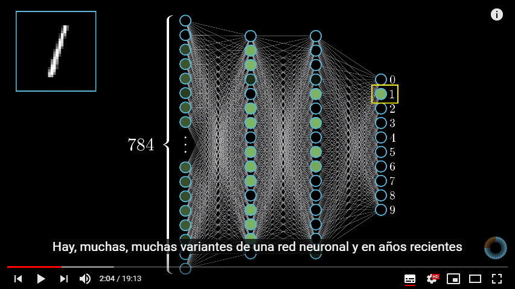

# IA: Inteligencia Artificial

### Objetivo

El objetivo de esta clase es que el alumno comprenda de manera simple qué es la inteligecia artificial. Así mismo, que interiorice conceptos  básicos asociados con la IA y que comprenda que supondrá en un futuro la implementación de esta tecnología.

[source](https://www.technologyreview.com/s/612437/what-is-machine-learning-we-drew-you-another-flowchart/)

| Contenido | Duración |
| ----- | ----- |
| **Clase** | **1 hora** |
| [Práctica](https://pauandalt.github.io/Practica_Redes_Neuronales/) | 30-45 minutos ||

***
## Inteligencia Arificial

### Qué es:
+ [Link 1](https://www.iberdrola.com/te-interesa/tecnologia/que-es-inteligencia-artificial)

+ [Link 2](https://es.wikipedia.org/wiki/Inteligencia_artificial)

> La inteligencia artificial (IA), es la inteligencia llevada a cabo por máquinas. En ciencias de la computación, una máquina «inteligente» ideal es un agente flexible que percibe su entorno y lleva a cabo acciones que maximicen sus posibilidades de éxito en algún objetivo o tarea.

[source](http://people.cs.ubc.ca/~poole/ci/ch1.pdf): Poole, David. «Computational Intelligence: A Logical Approach» (en inglés). Nueva York: Oxford University Press. p. 1. Consultado el 7 de junio de 2019.

### Cuáles son sus fundamentos:

### TIPOS DE INTELIGENCIA ARTIFICIAL

>Los expertos en ciencias de la computación Stuart Russell y Peter Norvig diferencian varios tipos de inteligencia artificial:

+ >Sistemas que piensan como humanos: automatizan actividades como la toma de decisiones, la resolución de problemas y el aprendizaje. Un ejemplo son las redes **_neuronales artificiales_**.

+ >Sistemas que actúan como humanos: se trata de computadoras que realizan tareas de forma similar a como lo hacen las personas. Es el caso de los **_robots_**.

+ >Sistemas que piensan racionalmente: intentan emular el pensamiento lógico racional de los humanos, es decir, se investiga cómo lograr que las máquinas puedan percibir, razonar y actuar en consecuencia. Los **_sistemas expertos_** se engloban en este grupo.

+ >Sistemas que actúan racionalmente: idealmente, son aquellos que tratan de imitar de manera racional el comportamiento humano, como los **_agentes inteligentes_**.

[Source](https://www.iberdrola.com/te-interesa/tecnologia/que-es-inteligencia-artificial)

### Aplicaciones prácticas de la inteligencia artificial

[Infografía](https://www.iberdrola.com/wcorp/gc/prod/es_ES/comunicacion/docs/Infografia_inteligencia_artificial.pdf)

## Redes Neuronales

+ Qué es una red neuronal:

+ Cómo trabaja:

 *video muy extenso pero muy completo sobre la explicación de cómo funciona una red neuronal. El profesor puede elegir que fragmentos poner dependiendo de cuanto se quiera profundizar.*

[ejemplo](https://cs.stanford.edu/people/karpathy/convnetjs/demo/classify2d.html) ejemplo de como una red neuronal clasefica los datos. Muy parecida a la práctica que se realizará al final de la clase

## Qué supondrá para nosotros, podemos controlarla completamente?

https://www.ted.com/talks/sam_harris_can_we_build_ai_without_losing_control_over_it?referrer=playlist-talks_on_artificial_intelligen#t-4542
